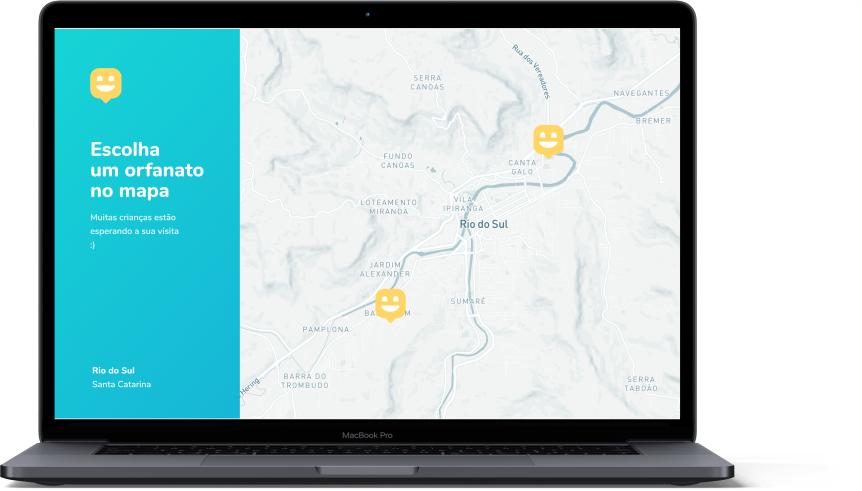
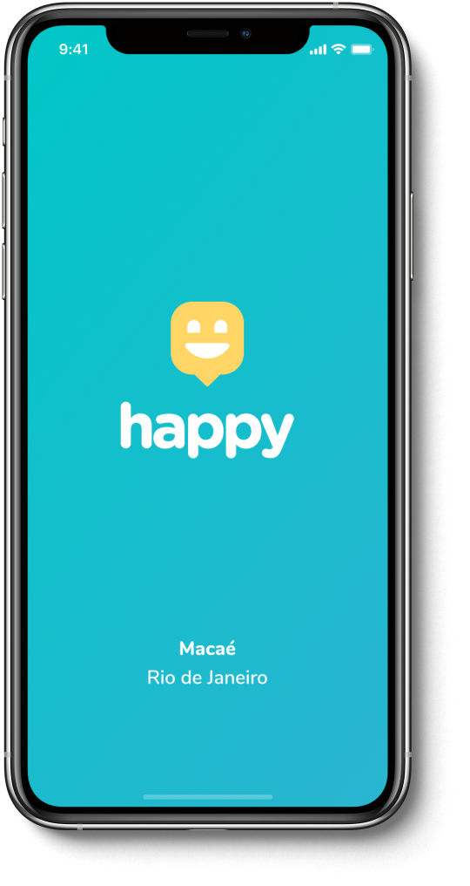
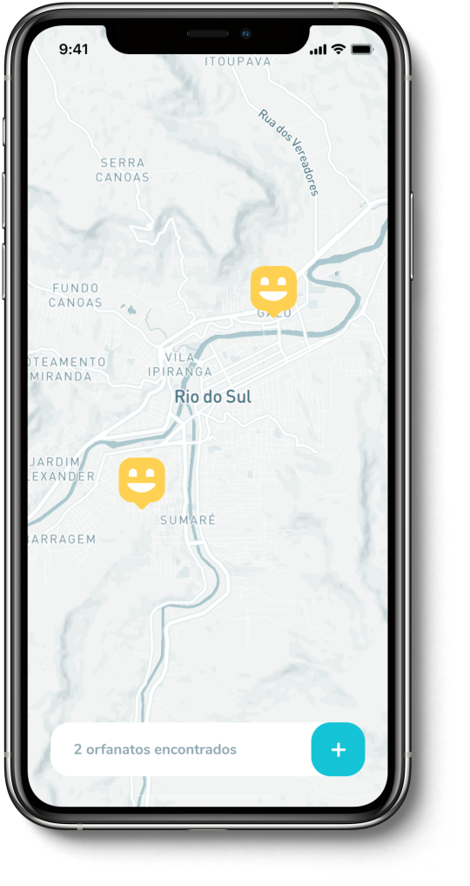

<p align="center">
   
</p>

<p align='center'>
  <a href="https://www.linkedin.com/in/bkkater/" align="center">
      
  </a>

</p>

<p align="center">	
  
  

  <a aria-label="Completed" href="https://nextlevelweek.com/episodios/omnistack/edicao/3">
    </img>
  </a>
  <a href="https://github.com/bkkater/happy/commits/master">
    
  </a> 
  
</p>

:rocket: Projeto feito com a finalidade de levar pessoas a visitar os orfanatos da cidade de Macaé 

<div align="center">
  <sub>The NLW #3 project. Built by
    <a href="https://github.com/bkkater">Bianca Medeiros</a>
  </sub>
</div>

# :pushpin: Tabela de Conteúdo

* [Site de Demostração](#eyes-site-de-demostração) 
* [Tecnologias](#computer-tecnologias)
* [Funcionalidades](#rocket-funcionalidades)
* [Como rodar](#construction_worker-como-rodar)
* [License](#closed_book-license)

## 📥 Layout disponivel em:  
<p align="center">
    <a title=".fig Web" href="https://www.figma.com/file/mDEbnoojksG4w8sOxmudh3/Happy-Web/duplicate">
        
    </a>
    <a title=".fig Mobile" href="https://www.figma.com/file/X27FfVxAgy9f5IFa7ONlph/Happy-Mobile/duplicate">
        
    </a>
</p>

### Web Screenshot
<div style="display: flex; flex-direction: 'row'; align-items: 'center';">
   
   
</div>

### Mobile Screenshot
<div style="display: flex; flex-direction: 'row';">
   
   
</div>

<p align="center">
  <a href="https://app.netlify.com/" target="_blank">
    
  </a>
</p>

# :computer: Tecnologias
Esse projeto foi feito utilizando as seguintes tecnologias:

* [Typescript](https://www.typescriptlang.org/)      
* [React](https://reactjs.org/)      
* [React Native](https://reactnative.dev/) 
* [Expo](https://expo.io/)       
* [Express](https://expressjs.com/) 

# :rocket: Funcionalidades

* Site para cadastro de orfanatos da cidade de Macaé.
* App para conectar visitantes ou doadores à orfanatos de Macaé.

# :construction_worker: Como rodar
```bash
# Clone o Repositório
$ git clone https://github.com/bkkater/happy.git
```
### 📦 Rode a API

```bash
# Vá para a pasta do servidor
$ cd happy/server
# Instale as depedencias
$ yarn install
# Rode a aplicação
$ yarn start
```
Acesse a API: http://localhost:3333/

### 💻 Rode o Project Web

```bash
# Vá para a pasta web
$ cd happy/web
# Instale as depedencias
$ yarn install
# Rode a aplicação
$ yarn start
```
Acesse: http://localhost:3000/ para ver o resultado.

### 📱 Run Mobile Project
Para rodar o projeto mobile você precisa de um celular com o [expo](https://play.google.com/store/apps/details?id=host.exp.exponent) instlado ou um emulador android/ios.

```bash
# Vá para a pasta mobile
$ cd happy/mobile
# Instale as depedencias
$ yarn install
# Rode a aplicação
$ yarn start
```
Depois leia o QRCode com o app do [expo](https://play.google.com/store/apps/details?id=host.exp.exponent) ou rode em um emulador.

# :closed_book: LICENSE

Made by [Bianca Medeiros](https://github.com/bkkater) 🚀.
Esse projeto está sobre [MIT license](./LICENSE).
